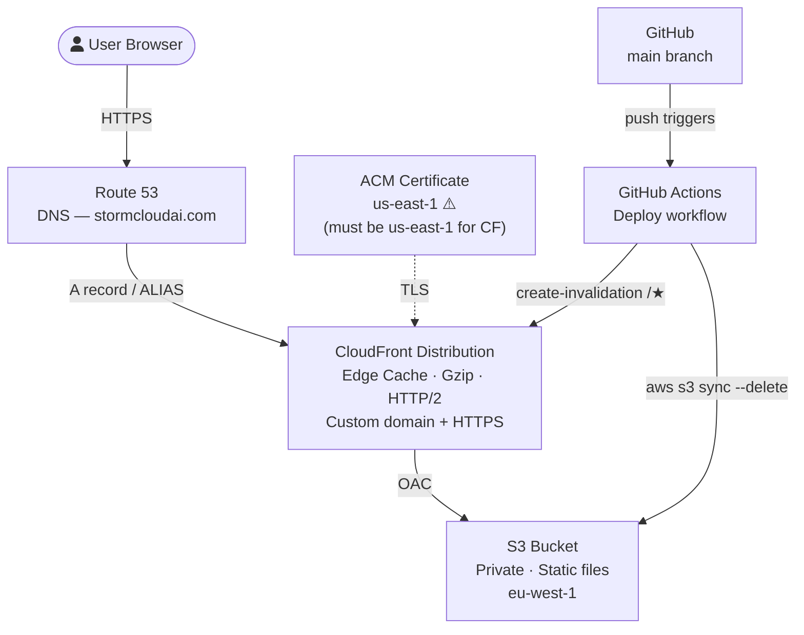

# StormCloud AI — Marketing Website Architecture

> **Keep this file updated** whenever infrastructure, pages, or deployment process changes.
> Read this at the start of every session involving the `04-stormcloudai` directory.

---

## What This Is

Static HTML/CSS/JS marketing website for StormCloud AI. No server-side rendering, no build step — pure static files served via CDN.

**Live URL:** TBD (domain registered, AWS account pending)
**Local dev:** `bash start.sh` → `http://localhost:8080` (Podman + nginx)

---

## Pages

| File | Purpose | Nav label |
|---|---|---|
| `index.html` | Homepage — hero, how it works, pricing teaser, FAQ, CTA | Home |
| `services.html` | Features — scan modules, AI plan detail | Features |
| `pricing.html` | Full pricing — 5 plan cards, comparison table, agency maths, FAQ | Pricing |
| `about.html` | Founder story, values, stats | About |
| `contact.html` | Contact form | Contact |

### Nav order (all pages)
Home → Features → Pricing → About → Sign In → Free SEO Scan (CTA)

---

## Pricing Structure

| Internal name | Display | Price | Own scans | Client sites |
|---|---|---|---|---|
| `free` | Free | £0 | 1 lifetime | 0 |
| `full_scan` | Starter | £49/mo | 5/mo | 0 |
| `agency` | Agency | £99/mo | Unlimited | 3 |
| `monthly` | Agency Pro | £199/mo | Unlimited | 10 |
| `consultancy` | Consultancy | £349/mo | Unlimited | 20 |

Sign-up buttons on pricing.html point to `http://localhost:3000/register` (update to production URL on deploy).

---

## Current State (Local)

```
Podman container (nginx:1.27-alpine)
  └── Static files copied at build time (see Dockerfile)
  └── Port 8080 → port 80 inside container
```

**IMPORTANT:** Every new `.html` file must be added to `Dockerfile` as an explicit `COPY` line — the Dockerfile does not glob `*.html`.

---

## Target Infrastructure (AWS)



### Key AWS decisions

| Decision | Choice | Reason |
|---|---|---|
| S3 access | Private bucket + OAC | OAI is deprecated; OAC is current best practice |
| SSL cert region | us-east-1 | CloudFront requires ACM certs in us-east-1 regardless of bucket region |
| Bucket region | eu-west-1 | Users are UK-based |
| Cache invalidation | `/*` on every deploy | Simple; site is small, invalidation cost negligible |
| Compression | CloudFront gzip + brotli | Enabled at distribution level, not S3 |
| Custom error | 404 → `/index.html` (200) | Handles direct URL navigation |

### CloudFront distribution settings (checklist)
- [ ] Origin: S3 bucket via OAC (not website endpoint)
- [ ] Viewer protocol: Redirect HTTP → HTTPS
- [ ] Allowed HTTP methods: GET, HEAD
- [ ] Compress objects automatically: Yes
- [ ] Default root object: `index.html`
- [ ] Custom error response: 404 → `/index.html`, 200
- [ ] Price class: PriceClass_100 (US/EU only — saves cost, audience is UK)
- [ ] Alternate domain names: `stormcloudai.com`, `www.stormcloudai.com`

---

## Deployment Workflow (GitHub Actions)

```yaml
# .github/workflows/deploy-website.yml
name: Deploy Marketing Site
on:
  push:
    branches: [main]
    paths:
      - '04-stormcloudai/**'

jobs:
  deploy:
    runs-on: ubuntu-latest
    steps:
      - uses: actions/checkout@v4
      - uses: aws-actions/configure-aws-credentials@v4
        with:
          role-to-assume: arn:aws:iam::ACCOUNT_ID:role/GitHubActionsWebsiteDeployer
          aws-region: eu-west-1
      - name: Sync to S3
        run: |
          aws s3 sync ./04-stormcloudai s3://BUCKET_NAME \
            --exclude "*.sh" \
            --exclude "Dockerfile" \
            --exclude "nginx.conf" \
            --exclude ".git*" \
            --exclude "ARCHITECTURE.md" \
            --exclude "README.md" \
            --delete
      - name: Invalidate CloudFront
        run: |
          aws cloudfront create-invalidation \
            --distribution-id DISTRIBUTION_ID \
            --paths "/*"
```

**Auth method:** OIDC (no long-lived AWS keys stored in GitHub secrets) — IAM role with `sts:AssumeRoleWithWebIdentity` trusted to GitHub Actions.

---

## Infrastructure as Code

All AWS infrastructure is managed via **Terraform** in the `stormcloud-infrastructure` repo.
Never create AWS resources manually — always go through Terraform so state is tracked.

### Repo structure
```
stormcloud-infrastructure/
├── modules/
│   ├── marketing-site/   ← this website
│   ├── client-site/      ← reusable per client (S3+CF+IAM+DNS)
│   └── platform/         ← ECS, RDS, SQS for 06-seo
├── environments/
│   ├── prod/
│   │   ├── backend.tf    (state: S3 + DynamoDB lock)
│   │   ├── marketing.tf
│   │   ├── platform.tf
│   │   └── clients.tf    ← one module call per client
│   └── dev/
└── .github/workflows/terraform.yml  (plan on PR, apply on main)
```

### Terraform state bootstrap (one-off, manual)
Before any `terraform apply`:
1. Create S3 bucket for state: `stormcloud-terraform-state`
2. Create DynamoDB table for locking: `stormcloud-terraform-locks`
3. Create IAM role for GitHub Actions Terraform runner

### Setup checklist
- [ ] AWS account created
- [ ] Terraform state S3 bucket + DynamoDB table bootstrapped
- [ ] `stormcloud-infrastructure` repo created
- [ ] `modules/marketing-site` written + `terraform apply` run
- [ ] DNS records live (Route 53 A/AAAA ALIAS to CloudFront)
- [ ] Update all `localhost:3000` links in HTML to production app URL
- [ ] Sitemap.xml and robots.txt domains updated

---

## Client Static Site Hosting — Repo Structure

Each client gets their own GitHub repo created from **`stormcloud-client-template`**.

```
stormcloud-client-{clientname}/
├── .github/
│   └── workflows/
│       └── deploy.yml        ← push to main → auto-deploys
├── index.html
├── css/style.css
├── js/main.js
├── images/
├── stormcloud.config.json    ← s3Bucket, cloudfrontDistributionId, domain
└── README.md                 ← plain English deploy instructions for client
```

**Client access:** collaborator on their own repo only. They push changes, GitHub Actions deploys. They never touch AWS.

**Per client, set 3 GitHub repo secrets:** `AWS_ACCOUNT_ID`, `CLIENT_ID`, and values in `stormcloud.config.json`.

### IAM — one role per client

```
GitHub OIDC Provider (one, shared)
  ├── Role: stormcloud-deploy-{clientname}
  │     Trust: repo:ORG/stormcloud-client-{clientname}:*
  │     Policy: s3:Put/Delete on their bucket + CF invalidation on their dist only
  └── Role: stormcloud-deploy-website
        Trust: repo:ORG/04-stormcloudai:*
        Policy: marketing site bucket + distribution only
```

Blast radius per client is their resources only. Provisioning per client:
1. Create S3 bucket (`stormcloud-client-{name}`)
2. Create CloudFront distribution (OAC, custom domain)
3. Create IAM role (scoped trust + scoped policy)
4. Set GitHub repo secrets
5. Give client collaborator access to their repo

Future: Automate steps 1–4 via AWS SDK from 06-seo API on client onboarding.

---

## CSS Architecture Note

**Only `css/style.css` applies in the browser.** Inline `<style>` blocks in HTML pages do NOT reliably apply. All styling must be added to `css/style.css` as named classes. Never use inline styles on nested elements.

---

*Last updated: 2026-05-17*
